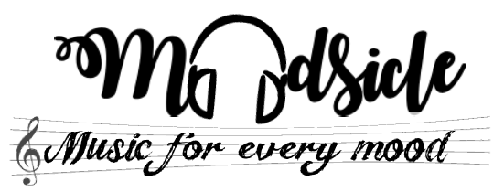
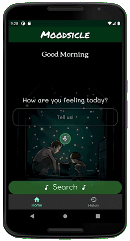
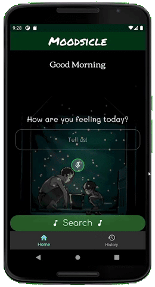
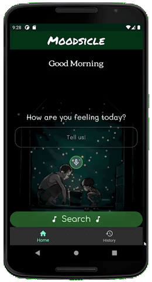

<h1 align="center">
  
</h1>
<h3 align="center">Find the right song for the right mood, anytime.</h3>

	
	
	
	
	
	
	

<h4 align="center">A Hack&Roll 2021 Project by Team FlutterAway (<a href="https://github.com/GabrielTeo">@GabrielTeo</a>, <a href="https://github.com/todoge">@todoge</a>, <a href="https://github.com/VaishakAnand">@VaishakAnand</a> and <a href="https://github.com/zongxian-ctrl">@zongxian-ctrl</a>).</h4>

## _Moodsicle_ - Music for every mood. :headphones:

Ever felt like sometimes you just couldn't find the right song? Or that the music just didnt quite fit the mood?

We were listening to some music and were pretty tired of them, and we thought "Hey, the mood's pretty sad, and we always listen to the same songs on loop. Imagine if we had a way to suggest songs based on your mood".

And that's exactly what we have done for [**Hack&Roll 2021**](https://hacknroll.nushackers.org/)! We have built an application that suggests music based on your current mood, regardless of the occasion! Never will you ever have the problem of surfing through endless tracks of songs just to find the right one again, all thanks to our multi-platform mobile application **Moodsicle**!

  
  
  

## Main Features :musical_note:

* **Song search based on mood** :shrug:
	* Type however you are feeling into the text box and search for the perfect song!
* **Speech to text enabled** :speech_balloon:
	* Option to speak into the mic without typing!
* **Search history** :bookmark_tabs:
	* Searched songs are stored so you can find them again anytime!
* **Music data powered by _Musicovery_** :zap:
	* Backed by a comprehensive music recommendation engine with playlist charts since 1960!
* **Cross-platform** :iphone:
	* iOS and Android ready!
* **Many more planned features!** :hourglass_flowing_sand:
	* Moodsicle is currently in development and we hope to bring more features in the future!

## Moodsicle's Roadmap! :world_map:

* We plan to include _Spotify_'s API to link the songs to _Spotify_ so that users can open the songs directly in _Spotify_.
* We hope to include an in-app music player with full standard player functionalities (users can play and listen to songs on-the-go, as well as forward / reverse / skip tracks).

## Getting Started :beginner:

If you want to try out _Moodsicle_, you can head over to our [Releases](https://github.com/GabrielTeo/Moodsicle/releases) to install our latest Android APK on your Android device. However, as _Moodsicle_ is still currently in very early development, please note that we have yet to release an iOS IPA, and our releases may not be up to date with the latest version of our development as we continue to improve our application.

However, if you are a developer looking to test our application, or want to try our the latest version of our application, here are the steps required to get a debugging environment set up to run our current debug build:
* **1.** Install the **Flutter SDK** according to the [Flutter Installation Guide](https://flutter.dev/docs/get-started/install). Ensure that `flutter doctor -v` shows no errors for the platform that you intend to test on (Android or iOS).
* **2.** Clone this repository to your computer and navigate to it.
* **3.** Follow the instructions in the links below to set up an emulator or a physical device to run the application in debug mode:
	* **3.1.** [Android Setup](https://flutter.dev/docs/get-started/install/macos#android-setup)
	* **3.2.** [iOS Setup](https://flutter.dev/docs/get-started/install/macos#ios-setup)
* **4.** Running `flutter run` will launch _Moodsicle_ on your emulator/device. To install a portable debug version of the application on your physical device, ensure the device is connected and run  `flutter install`.

## Development :hammer_and_wrench:
We built _Moodsicle_ with:
* **[Flutter](https://flutter.dev/)** - Mobile, web and desktop UI SDK framework using Dart.
* **[Musicovery API](http://b2b.musicovery.com/)** - Music recommendation engine.
* **[Sentiment Dart](https://pub.dev/packages/sentiment_dart)** - Sentiment analysis processing.
* **[speech_to_text](https://pub.dev/packages/speech_to_text)** - Speech recognition.
* **[sqflite](https://pub.dev/packages/sqflite)** - SQL database engine.

We welcome contributors to work on _Moodsicle_ together with us! Feel free to make various improvements as you see fit. Changes will however be subject to approval through pull requests.

## Hackathon and Learning Experience :black_nib:

Visit our project's [Devpost](https://devpost.com/software/moodsicle) to learn more about what we went through in the 24 hours in building _Moodsicle_!

## License :memo:

This project is licensed under the MIT License - see the [LICENSE](https://github.com/GabrielTeo/Moodsicle/blob/master/LICENSE) file for details.
